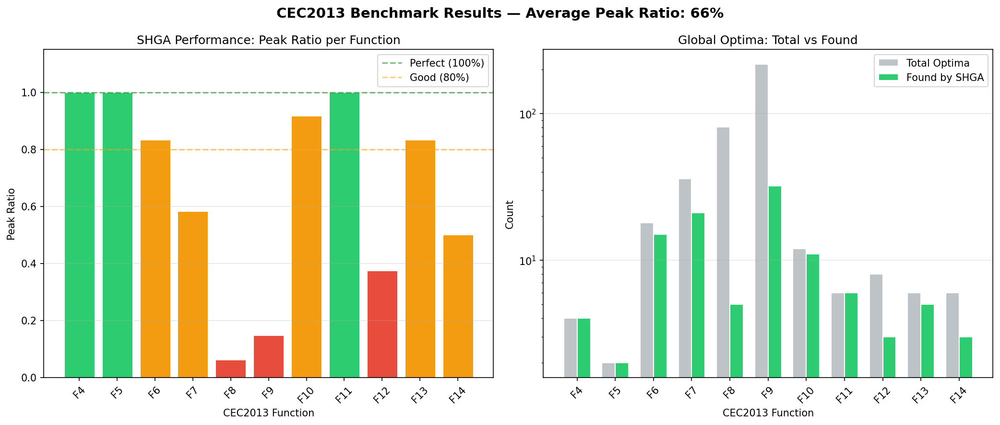
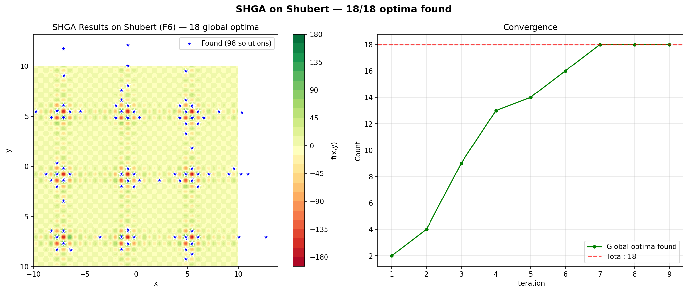
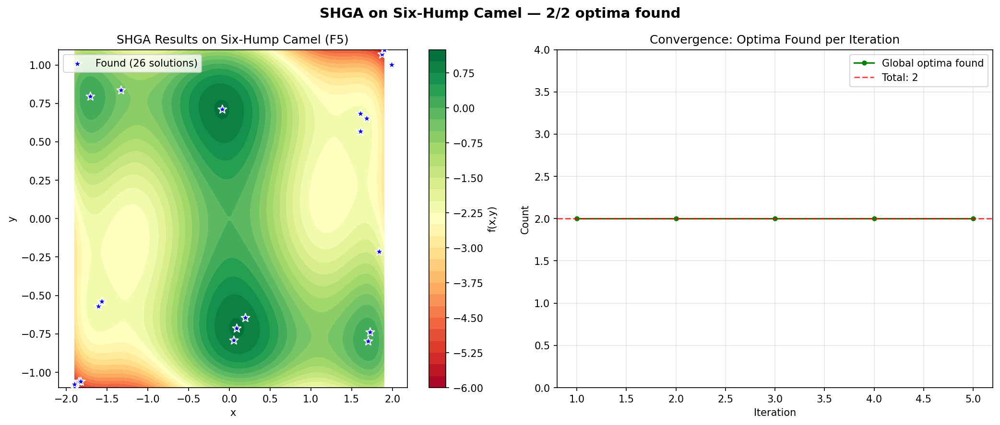

# Multi-Modal Optimization with Scalable Hybrid Genetic Algorithm (SHGA)

[](https://doi.org/10.5281/zenodo.19184224)

Find multiple local and global optima of continuous functions using a hybrid approach combining Deterministic Crowding GA with CMA-ES local refinement.


> **Key finding**: SHGA reliably discovers all 4 global optima of Himmelblau's function within 50,000 evaluations, with 3-4x speedup via multi-core parallelization on NAIC Orchestrator VMs.

## Table of Contents

1. [Overview](#overview)
2. [Methodology](#methodology)
3. [Sample Results](#sample-results)
4. [Getting Started](#getting-started)
5. [CLI Reference](#cli-reference)
6. [NAIC Orchestrator VM Deployment](#naic-orchestrator-vm-deployment)
7. [Troubleshooting](#troubleshooting)
8. [References](#references)
9. [License](#license)

## Overview

Multimodal optimization problems require finding multiple optima (both global and local) rather than a single best solution. This is common in engineering design, molecular modeling, and scientific parameter estimation where multiple viable solutions exist.

This repository implements the Scalable Hybrid Genetic Algorithm (SHGA), validated against the CEC2013 multimodal benchmark suite with 20 test functions across 2-20 dimensions.

The interactive [`demonstrator.ipynb`](demonstrator.ipynb) notebook showcases the full workflow.

### What This Repository Includes

| Component | Description |
|-----------|-------------|
| `mmo/` | Core SHGA algorithm package (minimizer, GA, CMA-ES, parallel support) |
| `mmo/cma_ext/` | Embedded CMA-ES library (BSD 3-Clause) |
| `benchmarks/CEC2013/` | CEC2013 benchmark suite (included directly) |
| `data/` | Benchmark data files for CEC2013 functions |
| `demonstrator.ipynb` | Interactive Jupyter notebook with parallel support |
| `content/` | Sphinx tutorial documentation (10 episodes) |
| `AGENT.md` / `AGENT.yaml` | AI coding assistant instructions |

## Methodology

1. **Initialize population** with random sampling across the search domain
2. **Global exploration** using a Deterministic Crowding Genetic Algorithm — maintains diversity by replacing only similar individuals
3. **Seed detection** via nearest-neighbor clustering — identifies promising regions from the evolved population
4. **Local refinement** with CMA-ES — runs one CMA-ES instance per seed for high-precision convergence to optima
5. **Solution merging** — removes duplicate solutions within a distance tolerance
6. **Population scaling** — increases population size and repeats the outer loop for more thorough exploration

The algorithm supports optional multi-core parallelization (inner-loop) with 3-4x speedup on 16-core VMs.

**Available solvers**:

| Solver | Class | Parallelism | Use Case |
|--------|-------|-------------|----------|
| Sequential | `MultiModalMinimizer` | Single core | Small problems, debugging |
| Parallel | `MultiModalMinimizerParallel` | `n_jobs=-1` (all cores) | Production runs, benchmarks |

## Sample Results

### CEC2013 Benchmark Summary



### Individual Function Results

**Himmelblau (F4) — 4/4 optima found**


**Shubert (F6) — 18 optima**



**Six-Hump Camel (F5)**



### CEC2013 Benchmark Functions

| ID | Name | Dim | Optima | Budget |
|----|------|-----|--------|--------|
| 1 | Five-Uneven-Peak | 1 | 2 | 50,000 |
| 2 | Equal Maxima | 1 | 5 | 50,000 |
| 3 | Uneven Decreasing Max | 1 | 1 | 50,000 |
| 4 | Himmelblau | 2 | 4 | 50,000 |
| 5 | Six-Hump Camel | 2 | 2 | 50,000 |
| 6 | Shubert | 2 | 18 | 200,000 |
| 7 | Vincent | 2 | 36 | 200,000 |
| 8-14 | Higher-dimensional | 2-20 | 6-216 | 400,000 |

See the [full documentation](https://naicno.github.io/wp7-UC6-multimodal-optimization/) for all 20 functions.

## Getting Started

### Project Structure

```
wp7-UC6-multimodal-optimization/
├── AGENT.md / AGENT.yaml              # AI assistant instructions
├── Makefile                            # Sphinx docs build
├── README.md
├── PARALLELIZATION.md                  # Parallel performance details
├── VISUALIZATION.md                    # Plot behavior documentation
├── content/                            # Sphinx tutorial (10 episodes)
│   ├── episodes/                       # Tutorial chapters
│   └── images/                         # Tutorial images
├── benchmarks/CEC2013/                 # Benchmark suite (included directly)
├── data/                               # CEC2013 data files
├── demonstrator.ipynb                  # Interactive notebook (parallel)
├── mmo/                                # Core SHGA algorithm
│   ├── minimize.py                     # MultiModalMinimizer (sequential)
│   ├── minimize_parallel.py            # MultiModalMinimizerParallel
│   ├── domain.py                       # Search space definition
│   ├── ga_dc.py                        # Deterministic Crowding GA
│   ├── ga_seed.py                      # Seed detection
│   ├── cma.py                          # CMA-ES wrapper
│   ├── ssc.py / ssc_parallel.py        # Seed-Solve-Collect loops
│   ├── solutions.py                    # Solution management
│   └── cma_ext/                        # Embedded CMA-ES library
├── generate_figures.py                 # Generate tutorial images
├── generate_benchmark_only.py          # Run benchmark suite
├── test_*.py                           # Test files
├── setup.sh                            # Python environment setup
├── fix-cec2013.sh                      # CEC2013 build fix script
└── vm-init.sh                          # VM initial setup
```

### Installation

#### On NAIC Orchestrator VM (recommended)

```bash
git clone --recursive https://github.com/NAICNO/wp7-UC6-multimodal-optimization.git
cd wp7-UC6-multimodal-optimization
./setup.sh
source activate-mmo.sh
```

> **Note:** The CEC2013 benchmark suite is included directly in the repository.

#### Manual Installation

```bash
git clone --recursive https://github.com/NAICNO/wp7-UC6-multimodal-optimization.git
cd wp7-UC6-multimodal-optimization
python3 -m venv venv
source venv/bin/activate
pip install -r requirements.txt
./fix-cec2013.sh
source activate-mmo.sh  # Sets PYTHONPATH for CEC2013
```

### Usage

**Jupyter notebook** (recommended):

```bash
jupyter lab --no-browser --ip=127.0.0.1 --port=8888
# Open demonstrator.ipynb
```

**Python API**:

```python
from mmo.minimize import MultiModalMinimizer
from mmo.domain import Domain
from cec2013.cec2013 import CEC2013

# Load Himmelblau benchmark (4 global optima)
f = CEC2013(4)
dim = f.get_dimension()
lb = [f.get_lbound(k) for k in range(dim)]
ub = [f.get_ubound(k) for k in range(dim)]
domain = Domain(boundary=[lb, ub])

# Find all optima
optimizer = MultiModalMinimizer(
    f=f, domain=domain, budget=50000, verbose=1
)

for result in optimizer:
    print(f"Iter {result.number}: {result.n_sol} solutions found")

print(f"Total: {optimizer.n_sol} solutions")
```

## CLI Reference

### Parallel Optimization

```python
from mmo.minimize_parallel import MultiModalMinimizerParallel

for result in MultiModalMinimizerParallel(
    f=f, domain=domain, budget=50000,
    max_iter=50, n_jobs=-1, verbose=1
):
    print(f"Found {result.n_sol} solutions")
```

| Parameter | Default | Description |
|-----------|---------|-------------|
| `f` | required | Objective function |
| `domain` | required | `Domain(boundary=[lb, ub])` |
| `budget` | required | Max function evaluations |
| `max_iter` | 50 | Max outer loop iterations |
| `n_jobs` | -1 | CPU cores (-1 = all) |
| `verbose` | 0 | Verbosity (0-2) |

For detailed parallelization benchmarks, see [PARALLELIZATION.md](PARALLELIZATION.md).

## NAIC Orchestrator VM Deployment

### Jupyter Access

1. Provision a VM at [https://orchestrator.naic.no](https://orchestrator.naic.no)
2. SSH to VM, clone with `--recursive`, run `./setup.sh`
3. Start Jupyter Lab:

```bash
tmux new -s jupyter
source activate-mmo.sh
jupyter lab --no-browser --ip=127.0.0.1 --port=8888
# Detach: Ctrl+B, then D
```

4. Create SSH tunnel from local machine:

```bash
ssh -f -N -L 8888:localhost:8888 -i <SSH_KEY_PATH> ubuntu@<VM_IP>
```

5. Open: **http://localhost:8888/lab/tree/demonstrator.ipynb**

### Background Training

```bash
tmux new-session -d -s benchmark 'cd ~/wp7-UC6-multimodal-optimization && source activate-mmo.sh && \
python generate_benchmark_only.py 2>&1 | tee benchmark.log'

tail -f benchmark.log
```

## Troubleshooting

| Issue | Solution |
|-------|----------|
| `cec2013` import error | Run `./fix-cec2013.sh` and `source activate-mmo.sh` to set PYTHONPATH |
| `ModuleNotFoundError: No module named 'mmo'` | Activate environment: `source activate-mmo.sh` |
| Build errors on Alpine/minimal OS | Install build tools: `sudo apt install -y build-essential python3-dev` |
| Connection refused to VM | Verify VM is running: `ping <VM_IP>` |
| SSH permission denied | `chmod 600 <SSH_KEY_PATH>` |

For visualization troubleshooting, see [VISUALIZATION.md](VISUALIZATION.md).

## References

- Johannsen, K., Goris, N., Jensen, B., & Tjiputra, J. (2022). A scalable, hybrid genetic algorithm for continuous multimodal optimization in moderate dimensions. *Nordic Machine Intelligence*, 02, 16-27. [DOI:10.5617/nmi.9633](https://doi.org/10.5617/nmi.9633)

## AI Agent

See [AGENT.md](AGENT.md) for machine-readable setup instructions for AI coding assistants (Claude Code, GitHub Copilot, Cursor, etc.).

## License

- **Tutorial content** (`content/`, `*.md`, `*.ipynb`): [CC BY-NC 4.0](https://creativecommons.org/licenses/by-nc/4.0/)
- **Software code** (`*.py`, `*.sh`): [GPL-3.0-only](https://www.gnu.org/licenses/gpl-3.0.html)
- Copyright: Sigma2 / NAIC

**Third-party components:**
- CMA-ES (BSD 3-Clause) — embedded in `mmo/cma_ext/`
- CEC2013 benchmarks (BSD 2-Clause) — included in `benchmarks/CEC2013/`
- DEAP (LGPL-3.0) — pip dependency
